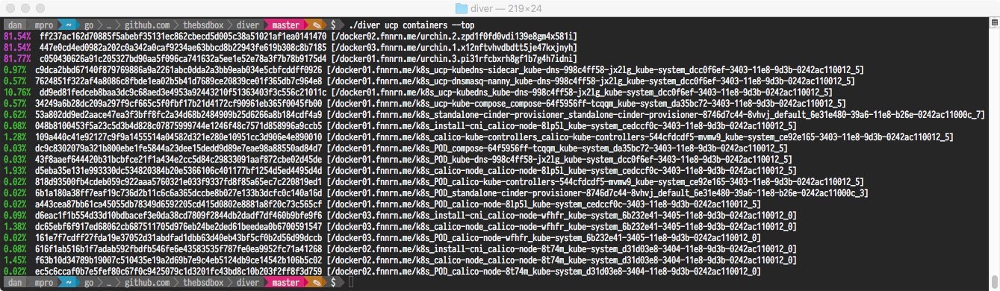

## Containers

### List all containers in the EE cluster

The `containers list` command will return all containers across the entire cluster.

```
$ diver ucp containers list
Name                                                                                           ID                 Image                            Node
urchin.1.r7it6s218brkbnz427kruhkun                                                             4a49c61d8ecdcc27   joeabbey/urchin:1.2             docker01
k8s_tiller_tiller-deploy-7c66b75f7f-rcfjh_kube-system_4c8dc88a-9093-11e8-8455-0242ac11000b_1   a8bef9a7c5b1e0b7   gcr.io/kubernetes-helm/tiller    docker03
dtr-scanningstore-be6fbea56f0a                                                                 6447966efb48a8a4   docker/dtr-postgres:2.5.2        docker02
dtr-notary-signer-be6fbea56f0a                                                                 9b55971453765f42   docker/dtr-notary-signer:2.5.2   docker02
dtr-jobrunner-be6fbea56f0a                                                                     aab1e55d1364c9c2   docker/dtr-jobrunner:2.5.2       docker02
dtr-nginx-be6fbea56f0a                                                                         81bb7feec3a522bc   docker/dtr-nginx:2.5.2           docker02
dtr-notary-server-be6fbea56f0a                                                                 730e1bd771fc98be   docker/dtr-notary-server:2.5.2   docker02
dtr-api-be6fbea56f0a                                                                           a33a092d9a863b15   docker/dtr-api:2.5.2             docker02
dtr-garant-be6fbea56f0a                                                                        3f61b4bac93af32e   docker/dtr-garant:2.5.2          docker02
dtr-registry-be6fbea56f0a                                                                      ade045fa2b25f399   docker/dtr-registry:2.5.2        docker02
dtr-rethinkdb-be6fbea56f0a                                                                     fc32fe6b7865340f   docker/dtr-rethink:2.5.2         docker02
```
## Deeper inspection of running containers

### Container networks

A `get networks --id <container id>` will return all networks a container is connected to. 

```
$ diver ucp containers get networks --id 4a49c61d8ecdcc27
Name      ID                          Address
ingress   lrnyprggay5rjuwn8wvpxzips   10.255.6.241
urchin    85mkj7ivqluhavashwxaggyh8   10.0.2.27
```

### Container processes

A `get processes --id <container id>` will return all processes that are running in a container.

```
$ diver ucp containers get processes --id 6447966efb48a8a4
UID    PID    PPID   C   STIME   TTY   TIME       CMD                                                
root   1596   1548   0   Jul28   ?     00:00:04   /dev/init -- /bin/postgreswrapper                  
root   2418   1596   0   Jul28   ?     00:00:26   /bin/postgreswrapper                               
70     2923   2418   0   Jul28   ?     00:00:00   postgres                                           
70     2964   2923   0   Jul28   ?     00:00:00   postgres: checkpointer process                     
70     2965   2923   0   Jul28   ?     00:00:03   postgres: writer process                           
70     2966   2923   0   Jul28   ?     00:00:03   postgres: wal writer process                       
70     2967   2923   0   Jul28   ?     00:00:01   postgres: autovacuum launcher process              
70     2972   2923   0   Jul28   ?     00:00:02   postgres: stats collector process                  
70     2973   2923   0   Jul28   ?     00:00:00   postgres: bgworker: logical replication launcher   
```

### Watching Containers

This will present a colour coded output on memory usage of all containers that are running in a swarm cluster.. (using [urchin](http://github.com/joeabbey/urchin) to hit memory reservations in the demo below)


```
./diver ucp containers top
```


